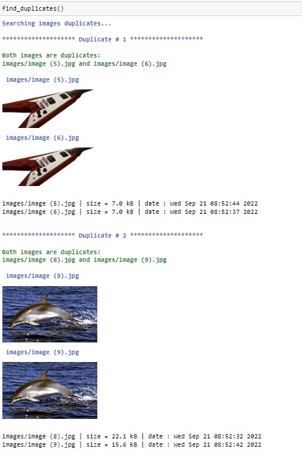

# Sentence Transformer for finding duplicates and similar images

SentenceTransformers provides models that allow to embed images and text into the same vector space. This allows to find similar images as well as to implement image search. We can also try to detect perfect duplicates from a collection of images or find similar images.

21-Sep-2022
Serge Retkowsky | serge.retkowsky@microsoft.com | https://www.linkedin.com/in/serger/
