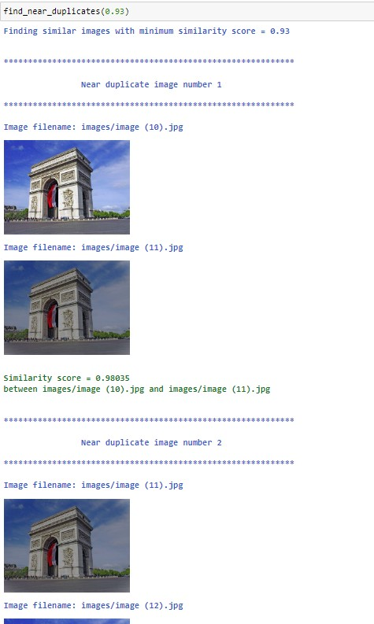

# Sentence Transformer for finding duplicates and similar images

**SentenceTransformers provides models that allow to embed images and text into the same vector space**. This allows to find similar images as well as to implement image search. We can also try to detect perfect duplicates from a collection of images or find similar images.

SentenceTransformers provides a wrapper for the **OpenAI CLIP Model, which was trained on a variety of (image, text)-pairs.**

You can find here some python code to **detect identical images and similar images** from a collection of images file.

Reference:
https://github.com/UKPLab/sentence-transformers/tree/master/examples/applications/image-search

 
Some examples:
 

 
 

 
 
21-Sep-2022
Serge Retkowsky | serge.retkowsky@microsoft.com | https://www.linkedin.com/in/serger/
